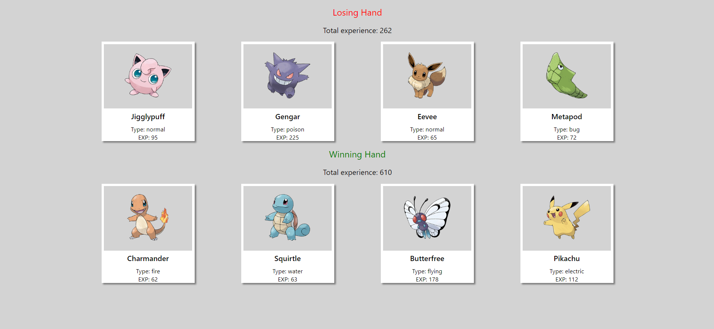

# Shopify-Task

<a name="descsection"></a>
## Description

I want to be the very best... at react.  Bad joke? I have more.

The purpose of this project was to utilize React props to complete the following tasks:* The App should render a single Pokegame
* Pokegame should take a list of 8 pokemon an randomly assign them into two hands of 4 cards each (repeats ok for now)
* Pokegame should calculate the the total experience for each hand and declare a winner/loser
* Pokecard should display the pokemon's name, type, image, and base experience
* The Pokecard image requires a function to push 0's in front of the pokemon id with one or two digits (4 -> 004, 35 -> 035, 109 -> 109)

[](https://opensource.org/licenses/MIT)


## Table of Contents
1. [ Description. ](#descsection)
2. [ Installation. ](#installsection)
3. [ License. ](#licensesection)
4. [ Contributing. ](#contribsection)
5. [ Tests. ](#testsection)
6. [ Questions. ](#questionssection)
7. [ Screenshots. ](#picsection)
8. [ Links. ](#linksection)
9. [ Resources/Credit. ](#creditsection)

<a name="installsection"></a>
## Installation
* Clone the repository using:
```
git clone https://github.com/laurelthorburn/Pokedex-Project.git
```
* Ensure you are in the current working directory
* Install dependencies by opening the terminal (ctrl + j on windows) and running:
```
npm install || npm i
```

* Run the project by typing the following in your integrated terminal:
```
npm run start
```

<a name="licensesection"></a>
## License
Copyright <2022>

Permission is hereby granted, free of charge, to any person obtaining a copy of this software and associated documentation files (the "Software"), to deal in the Software without restriction, including without limitation the rights to use, copy, modify, merge, publish, distribute, sublicense, and/or sell copies of the Software, and to permit persons to whom the Software is furnished to do so, subject to the following conditions:

The above copyright notice and this permission notice shall be included in all copies or substantial portions of the Software.

THE SOFTWARE IS PROVIDED "AS IS", WITHOUT WARRANTY OF ANY KIND, EXPRESS OR IMPLIED, INCLUDING BUT NOT LIMITED TO THE WARRANTIES OF MERCHANTABILITY, FITNESS FOR A PARTICULAR PURPOSE AND NONINFRINGEMENT. IN NO EVENT SHALL THE AUTHORS OR COPYRIGHT HOLDERS BE LIABLE FOR ANY CLAIM, DAMAGES OR OTHER LIABILITY, WHETHER IN AN ACTION OF CONTRACT, TORT OR OTHERWISE, ARISING FROM, OUT OF OR IN CONNECTION WITH THE SOFTWARE OR THE USE OR OTHER DEALINGS IN THE SOFTWARE.

  <a name="contribsection"></a>
## Contributing
  
1. [Fork the repo!](https://docs.github.com/en/get-started/quickstart/fork-a-repo)
2. Create a feature branch:
```
git checkout -b yourname-branch
```
3. Commit changes:
```
git commit -m 'Your changes here'
```
4. Push to the branch:
```
git push origin yourname-branch
```
5. Submit a pull request and wait for it to be approved or denied.

  <a name="testsection"></a>
## Tests

No tests at this time

  <a name="questionssection"></a>
## Creator

Laurel Thorburn

  <a name="picsection"></a>
  ## Screenshots
  


  <a name="linksection"></a>
  ## Links

  Deployed Github Page: https://laurelthorburn.github.io/Pokemon-Project/
  
  <a name="creditsection"></a>

## Resources/Credit

* https://poopcode.com/pad-a-number-with-leading-zeros-in-javascript/#:~:text=In%20JavaScript%2C%20to%20pad%20a,start%20of%20the%20current%20string
* https://w3bits.com/css-image-hover-zoom/